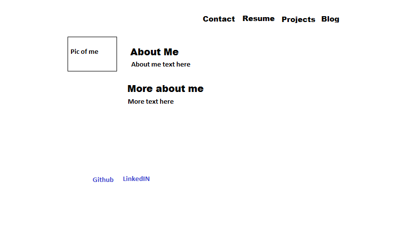

**What is a wireframe?**

A wireframe is a blueprint for a website or webpage. It helps you visualize the placement of text, links, photos, sections, etc... on your website.

**What are the benefits of wireframing?**

Wireframing benefits anyone who wants to see how their website would look, and settle on a design, before they start to code.

**Did you enjoy wireframing your site?**

I enjoyed wireframing my index and blog pages. I always outline projects before I begin.

**Did you revise the wireframe, or stick with your first idea?**

I stuck with my first idea, which was to model my site closely after the personal site of a programmer friend.

**What questions did you ask during the challenge? What resources did you find to help you answer them?**

I asked myself how elements on the site would be accessible and aesthetically pleasing to visitors (potential employers, but looking at you, mom). I used draggable/scalable elements on Mockingbird to create my wireframe, and my programmer friend's personal site for inspiration.

**Which parts of the challenge did you enjoy? Which did you find tedious?**

I enjoyed wireframing. There was nothing particularly tedious about this challenge.
