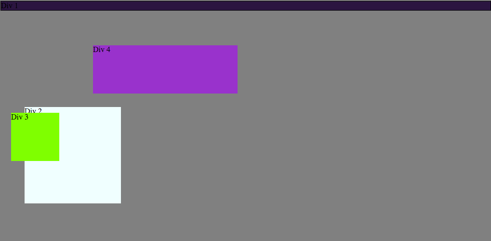
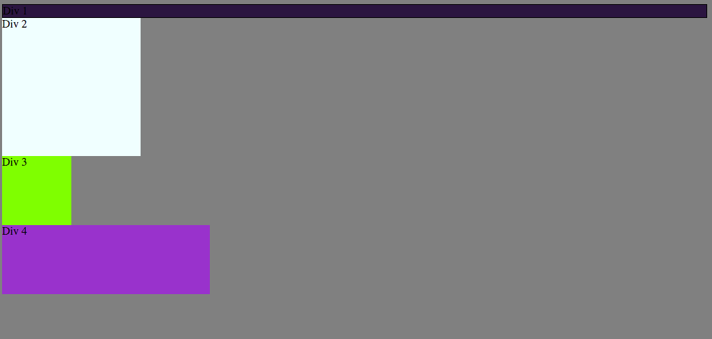
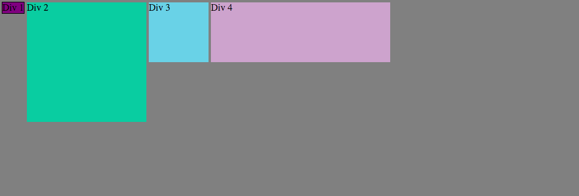
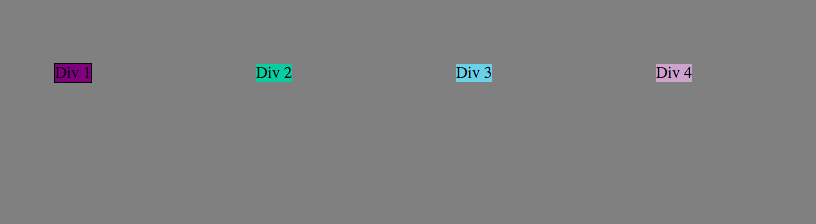
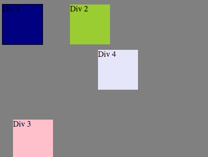
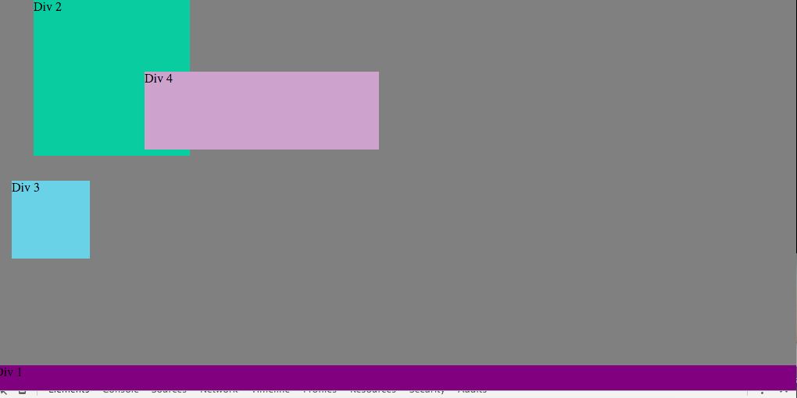
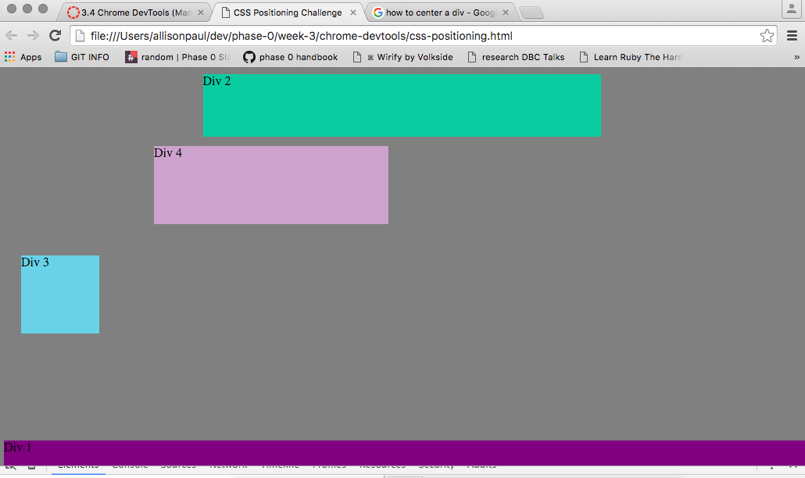
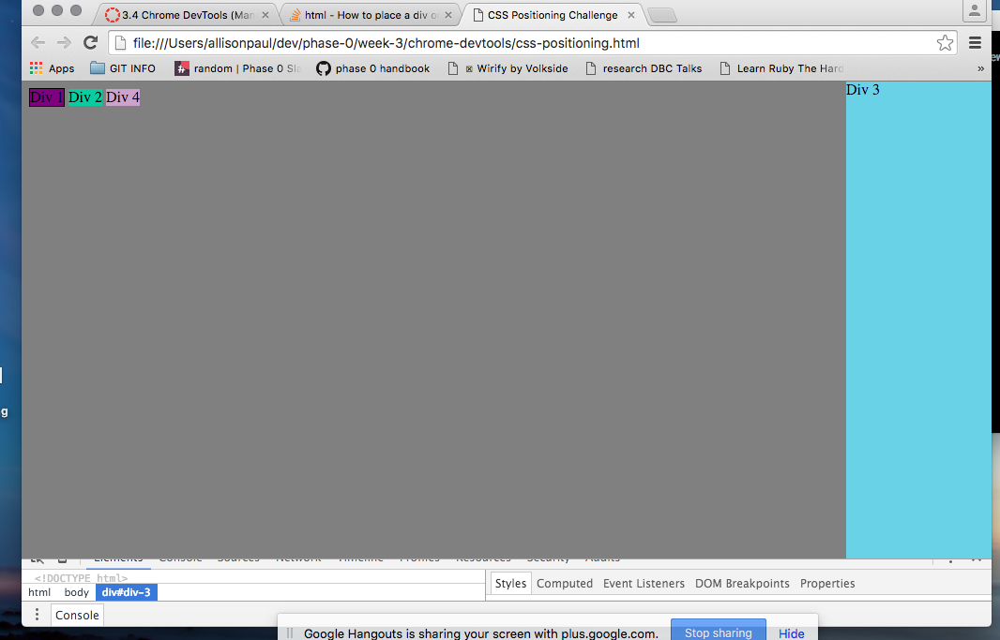
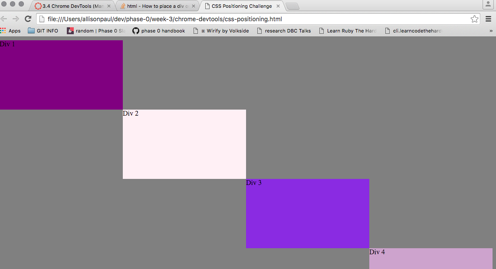

#3.4 Reflection

**How can you use Chrome's DevTools inspector to help you format or position elements?**

The DevTools inspector allow you to modify and preview your existing CSS files before needing to save or commit any changes.

**How can you resize elements on the DOM using CSS?**

You can resize elements by changing the values of attributes such as height and width, through options such as px, em, and %.

**What are the differences between absolute, static, fixed, and relative positioning? Which did you find easiest to use? Hardest?**

Statically positioned objects have no special positioning. Static is an object's default positioning. Absolute position places an object at a designation relative to one of its ancestors. Fixed position glues an object in a designated place. Relative position moves an object away from its static position.

**What are the differences between margin, borders, and padding?**

Padding is the empty space around an object. Borders are the boundary between an object an object and the rest of the page. Margins refer to the space between different objects. 

**What was your impression of this challenge overall?**

I enjoyed experimenting with CSS, though the sheer number of options was daunting.