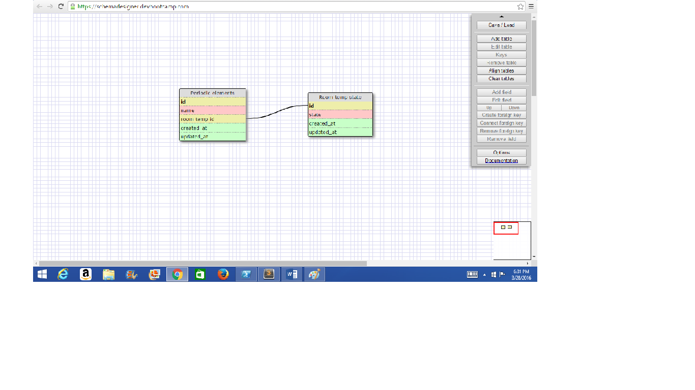
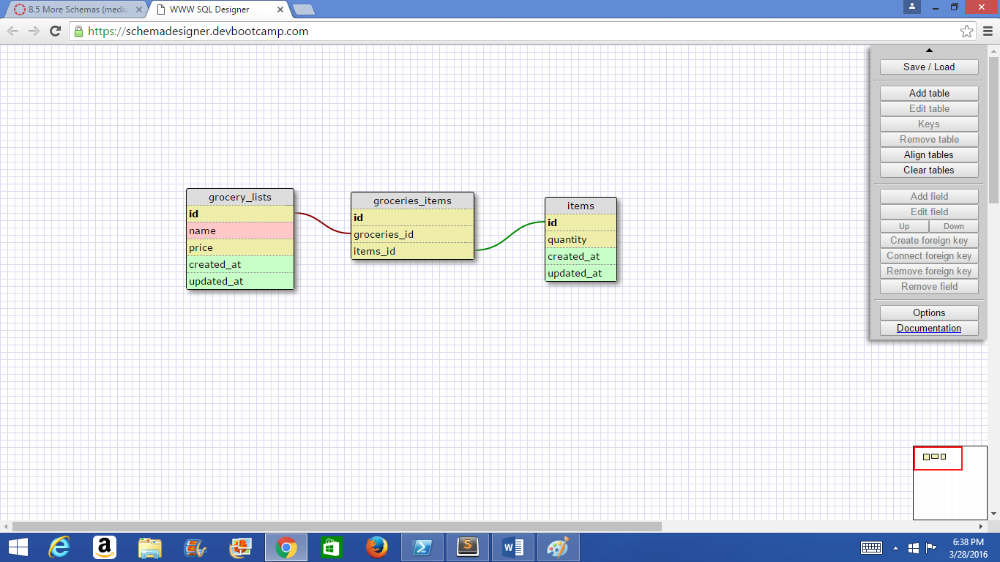

**Reflection**
 
**What is a one-to-one database?**
	A one-to-one database is one in which two attributes on different tables have a single relationship to one another.

**When would you use a one-to-one database? (Think generally, not in terms of the example you created).**
	Use a one-to-one database when one of the two attributes can optionally be empty.

**What is a many-to-many database?**
	A many-to-many database is one in which attributes on different tables have many relationships to each other.

**When would you use a many-to-many database? (Think generally, not in terms of the example you created).**
	Use a many-to-many database when there are many related attributes amongst tables.

**What is confusing about database schemas? What makes sense?**
	I'm still acquainting myself with SQL and database schemas, so everything is up in the air at the moment.